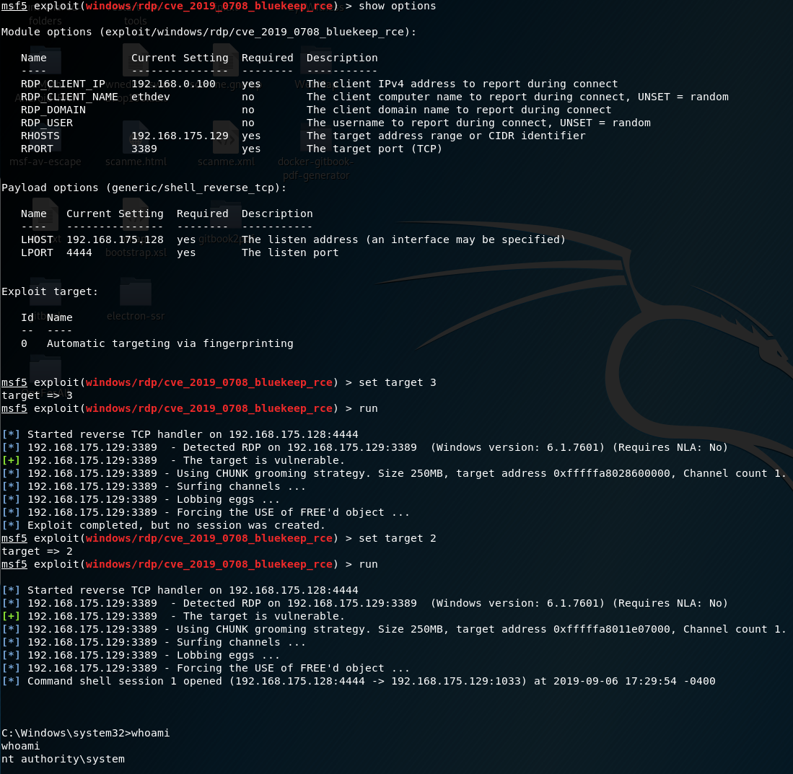

https://github.com/rapid7/metasploit-framework/pull/12283

cve_2019_0708_bluekeep.rb 添加 /usr/share/metasploit-framework/modules/exploits/windows/rdp/

rdp.rb 替换 /usr/share/metasploit-framework/lib/msf/core/exploit/rdp.rb

rdp_scanner.rb 替换 /usr/share//metasploit-framework/modules/auxiliary/scanner/rdp/rdp_scanner.rb

cve_2019_0708_bluekeep.rb 替换 /usr/share/metasploit-framework/modules/auxiliary/scanner/rdp/cve_2019_0708_bluekeep.rb

